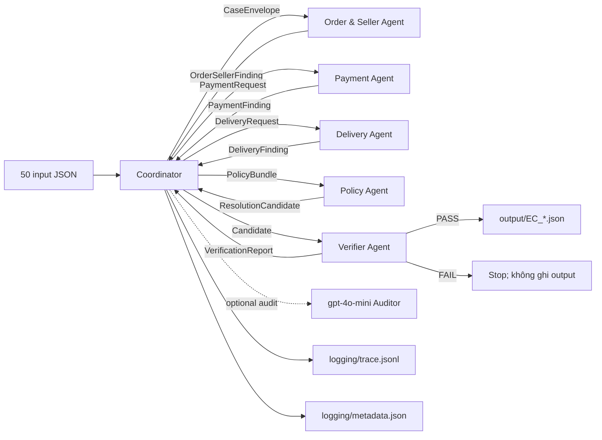
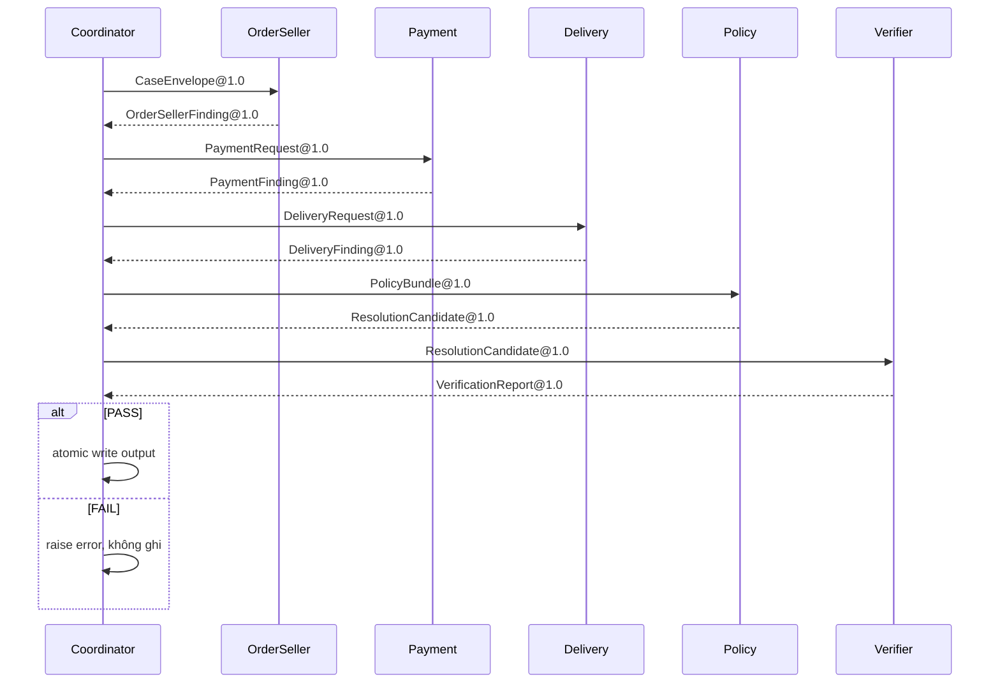

# Kiến trúc Multi-Agent E-commerce Dispute Resolution

## 1. Mục tiêu và nguyên tắc

Hệ thống xử lý 50 case bằng sáu agent độc lập, truyền typed handoff qua A2A envelope và chỉ ghi output khi Verifier đã đối chiếu lại CSV. Dữ liệu có thể kiểm chứng luôn thắng nội dung claim. Mọi phép tính tiền dùng `Decimal`, `ROUND_HALF_UP`, hai chữ số thập phân; timestamp được so sánh nguyên giá trị CSV, không đổi múi giờ.

Quyết định nghiệp vụ là deterministic để tái lập và đạt độ chính xác cao. `gpt-4o-mini` chỉ là lớp audit Structured Outputs tùy chọn, không có quyền thay đổi evidence, số tiền hoặc policy decision.

## 2. Sơ đồ agent và handoff





## 3. Vai trò và quyền truy cập

| Agent | Trách nhiệm | Được đọc | Bị cấm | Quyền ghi |
|---|---|---|---|---|
| Coordinator | Validate input, điều phối, merge, atomic write | Input JSON, policy/config | Không tự tính domain finding | `output/`, `logging/` |
| Order & Seller | Order status, items, seller, shipping limit, item/freight totals | orders, order_items, sellers | payments/reviews/geolocation | Không |
| Payment | Aggregate mọi payment row, reconcile tolerance 0.10 BRL | order_payments | items/orders ngoài handoff | Không |
| Delivery | So delivery estimate và seller handoff limit | orders + item deadlines trong handoff | payments/sellers | Không |
| Policy | Áp dụng đúng precedence EC_POLICY_V1 | Chỉ typed findings | Toàn bộ CSV | Không |
| Verifier | Re-query độc lập schema/entity/evidence/math/policy | orders, items, payments, sellers | customers/products/reviews/geolocation | Không |
| LLM Auditor (tùy chọn) | Kiểm tra consistency dạng JSON | Candidate đã redacted | CSV, secret, quyền quyết định | Không |

`CsvRepository` thực thi allowlist. Vi phạm quyền đọc gây `AccessViolation`, không trả dữ liệu.

## 4. A2A envelope và contracts

Mọi handoff có các field:

```text
protocol_version, run_id, trace_id, message_id, sent_at,
from_agent, to_agent, case_id, contract_name, contract_version,
status, payload, payload_sha256, errors
```

Contracts chính:

- `CaseEnvelope@1.0`: input case đã qua schema validation.
- `OrderSellerFinding@1.0`: status, item rows, seller IDs, item/freight totals.
- `PaymentRequest@1.0`: order ID và expected total từ handoff trước.
- `PaymentFinding@1.0`: payment rows, total, delta, reconciled.
- `DeliveryRequest@1.0`: order ID và shipping deadlines theo item.
- `DeliveryFinding@1.0`: carrier/customer/estimate timestamp, late flag, violating items/sellers.
- `PolicyBundle@1.0`: ba domain findings đã typed.
- `ResolutionCandidate@1.0`: issue, status, cause, party, refund, action.
- `VerificationReport@1.0`: từng check và structured errors.

Digest SHA-256 của payload giúp phát hiện handoff bị thay đổi và nối trace với artifact.

## 5. Policy precedence

Policy Agent áp dụng đúng thứ tự; match đầu tiên thắng:

1. canceled + paid → platform, full payment refund.
2. unavailable + paid → platform, full payment refund.
3. delivered late + carrier handoff sau bất kỳ item limit → violating seller, freight refund.
4. delivered late + không seller violation → logistics provider, freight refund.
5. từ hai payment row và total khớp item + freight trong 0.10 BRL → giải thích split payment.
6. delivered không sau estimate và payment khớp → bác late refund.

Điều này xử lý đúng hai overlap quan trọng: canceled thắng handoff-late; valid split payment thắng unsupported late claim.

## 6. Canonicalization và evidence

- Item/payment được sort theo integer `order_item_id`/`payment_sequential`.
- Aggregate mỗi bảng theo `order_id` trước, không join row-wise gây Cartesian product.
- Entity được deduplicate/sort trước khi áp giới hạn.
- Evidence chỉ gồm `order:`, `item:`, `payment:`, `seller:`, `policy:` và phải resolve được. `seller:<id>` chỉ được đưa vào khi primary issue là `late_delivery_seller`; ở issue khác nó là false positive dù seller row tồn tại.
- `affected_entities` bỏ prefix evidence nhưng giữ composite `order:item`/`order:sequential`.
- Order unavailable không có item: item/seller arrays rỗng, item/freight total bằng 0.

## 7. Validation gates và lỗi

Input/output schema nằm trong `schemas/`; runtime validator còn kiểm exact keys, enum, type, range, uniqueness và cardinality. Verifier re-query CSV độc lập và so exact sáu component. Chỉ Coordinator ghi file qua temp + `os.replace` sau khi Verifier PASS. Một case không match policy, thiếu order, evidence không resolve hoặc sai phép tính sẽ dừng run với lỗi; hệ thống không đoán và không tạo JSON bán hợp lệ.

`trace.jsonl` bị truncate khi bắt đầu run mới. Mỗi event có run/trace/span/sequence, agent, event type, digest, data access, validation và artifact reference; không log `.env` hoặc API key. `metadata.json` ghi model, runtime, framework, invocation count, git commit và checksum input/dataset.

## 8. Reproducibility và kiểm thử

```powershell
$env:PYTHONPATH = "src"
python -m dispute_agents.cli run
python -m pytest
python -m dispute_agents.cli grade
python -m dispute_agents.cli package --destination submission.zip
```

Local grader áp trọng số công khai `20/20/15/15/20/10`, nhưng không tuyên bố là bản sao exact server scorer vì frontend không công khai partial-match và hard-gate implementation.

## 9. Secret và giới hạn model

`.env` chỉ chứa `OPENAI_API_KEY` và đã được `.gitignore`; model name nằm trong source và metadata. OpenAI mô tả `gpt-4o-mini` là small model và hỗ trợ Structured Outputs, nhưng không công bố parameter count. Vì vậy metadata ghi trung thực `parameter_size=undisclosed_by_provider` và `parameter_compliance=not_verifiable`; không khẳng định sai rằng model chắc chắn ≤10B. Cần organizer xác nhận eligibility nếu bật LLM audit khi nộp chính thức.
